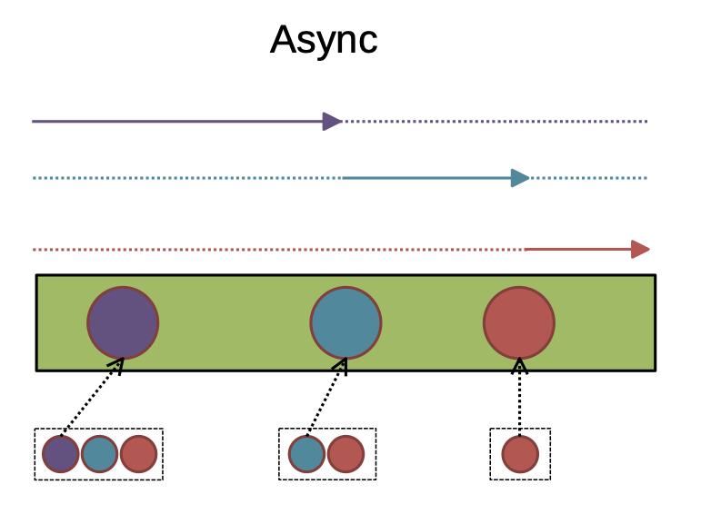
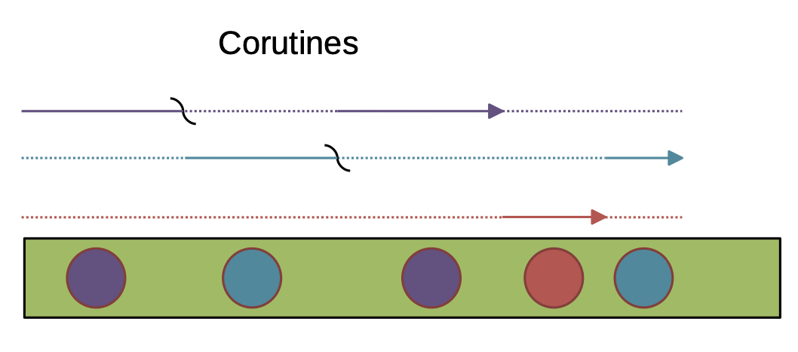
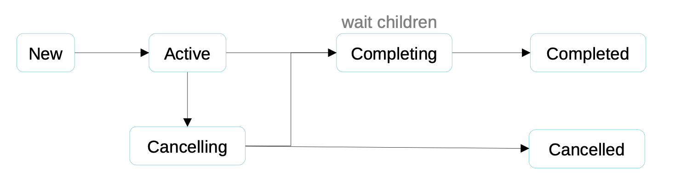
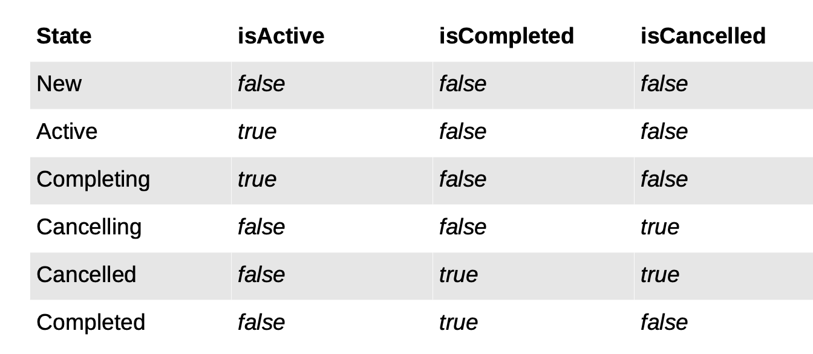
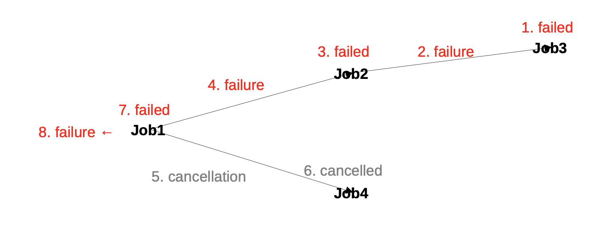
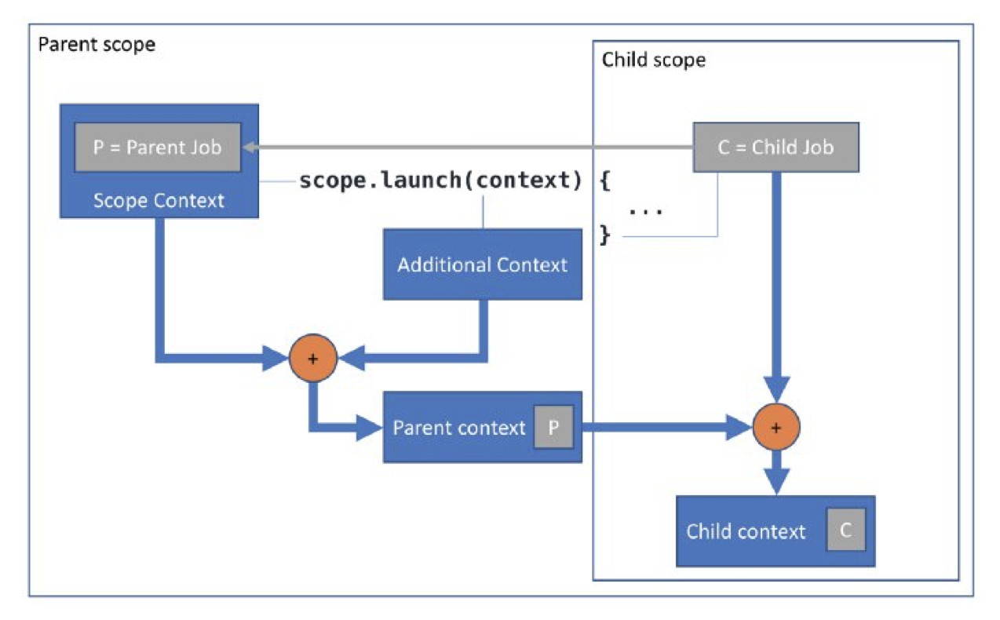

literature:  
https://kotlinlang.org/docs/coroutines-guide.html  
[KEEP](https://github.com/Kotlin/KEEP/blob/master/proposals/coroutines.md)    
[Coroutine Context and Scope](https://elizarov.medium.com/coroutine-context-and-scope-c8b255d59055)    
[habr - Паттерны и антипаттерны корутин в Kotlin](https://habr.com/ru/articles/432942/)  
[Deep coroutines guides](https://kt.academy/article/cc-why)


Корутина (coroutine, сопрограмма) — компонент программы, обобщающий понятие подпрограммы, который поддерживает множество входных/выходных точек, остановку и продолжение выполнения
с сохранением определенного состояния.

- [Синтаксис](#Синтаксис)
- [Continuation](#Continuation)
- [CoroutineContext](#CoroutineContext)
- [Coroutine-билдеры](#Coroutine-билдеры)
- [Запуск из блокирующего кода](#Запуск-из-блокирующего-кода)
- [Запуск параллельной задачи](#Запуск-параллельной-задачи)
- [Смена контекста выполнения](#Смена-контекста-выполнения)
- [Ограничение области выполнения](#Ограничение-области-выполнения)
- [Job: диаграмма состояний](#Job:-диаграмма-состояний)
- [Формирование дочернего контекста](#Формирование-дочернего-контекста)
- [Диспетчеры](#Диспетчеры)


### Синтаксис
```kotlin
// определение suspend-функции
suspend fun foo() {
    // ...
} 
```

```kotlin
// определение suspend-лямбды
val lambda = suspend {
    // ...
}
```

```kotlin
// suspend-функция как аргумент в сигнатуре
fun bar(block: suspend () -> Int) {
    // ...
}
```

```kotlin
// использование функции с аргументом suspend-функцией
bar {
    // ...
}
```

### Continuation
Continuation отвечает за сохранение состояния корутины и возможность дальнейшего продолжения работы из этого состояния.

```kotlin
interface Continuation<in T> {
    // The context of the coroutine that corresponds to this continuation. 
    val context: CoroutineContext

    // Resumes the execution of the corresponding coroutine 
    // passing a successful or failed [result]
    // as the return value of the last suspension point
    fun resumeWith(result: Result<T>)
}
```





### CoroutineContext

Состоит из:
- Job — управляет жизненным циклом корутины. 
- CoroutineDispatcher — отправляет работу в соответствующий поток. 
- CoroutineName — имя корутины, полезно для отладки. 
- CoroutineExceptionHandler — обрабатывает не отловленные исключения.

### Coroutine билдеры

- **runBlocking** - из блокирующего в корутины
- **launch** - запускает не блокируя и не прерывая
- **async** - запускает не блокируя и не прерывая, можно получить результат
- **withContext** - позволяет сменить контекст
- **coroutineScope** - создает новую ограниченную область выполнения

### Запуск из блокирующего кода

**runBlocking** – coroutine-билдер, используемый в качестве моста между блокирующим кодом и корутинами.  
- Возвращает результат выполнения заданного блока
- Блокирует поток
- Можно использовать для main-функции, тест- функций и т.п.
- Доступен на платформах JVM и Native 
- Недоступен в JS

```kotlin
public fun <T> runBlocking(
    context: CoroutineContext = EmptyCoroutineContext,
    block: suspend CoroutineScope.() -> T
): T

fun main(): Unit = runBlocking { 
    println("Hello")
    delay(1000)
    println("World")
}
```

### Запуск параллельной задачи
**launch** – неблокирующий coroutine-билдер для создания и запуска корутин
- Не блокирует поток
- Не прерывает корутину

```kotlin
public fun CoroutineScope.launch(
    context: CoroutineContext = EmptyCoroutineContext, 
    start: CoroutineStart = CoroutineStart.DEFAULT, 
    block: suspend CoroutineScope.() -> Unit
): Job

val job = GlobalScope.launch { 
    // ...
} 
```

**async** – неблокирующий coroutine-билдер, для создания и запуска корутин, возвращающих значение.
- Не блокирует поток
- Не прерывает корутину

```kotlin
public fun <T> CoroutineScope.async(
    context: CoroutineContext = EmptyCoroutineContext, 
    start: CoroutineStart = CoroutineStart.DEFAULT, 
    block: suspend CoroutineScope.() -> T
): Deferred<T>

val deferred = GlobalScope.async { 
    // ...
}
```

### Смена контекста выполнения
**withContext** – coroutine-билдер для создания и запуска корутин, контекст которых получен из слияния текущего и заданного аргументом контекстов
- Возвращает результат выполнения заданного блока
- Прерывает корутину
- Ожидает завершения созданной корутины

```kotlin
public suspend fun <T> withContext(
    context: CoroutineContext,
    block: suspend CoroutineScope.() -> T
): T

withContext(CoroutineName("My awesome coroutine")) {
    // ... 
}
```

### Ограничение области выполнения
**coroutineScope** – coroutine-билдер для создания и запуска корутин в ограниченной области выполнения
- Возвращает результат выполнения заданного блока
- Прерывает корутину
- Ожидает завершения созданной корутины

```kotlin
suspend fun <R> coroutineScope(
    block: suspend CoroutineScope.() -> R
): R

coroutineScope { 
    // ...
}
```


### Job: диаграмма состояний





Пример распространения ошибки:


### Формирование дочернего контекста
- Родительский контекст = значения по умолчанию + текущий (унаследованный CoroutineContext) + аргументы
- Создается дочерняя задача Job
- Контекст новой корутины = родительский контекст + дочерняя Job



### Диспетчеры
Диспетчер корутин может ограничить выполнение корутины определенным потоком

- **Dispatchers.Default** - для выполнения по умолчанию
- **Dispatchers.IO** - для выполнения блокирующего кода
- **Dispatchers.Main** - для безопасной работы с GUI
- **asCoroutineDispatcher** - если нужен свой пул потоков


