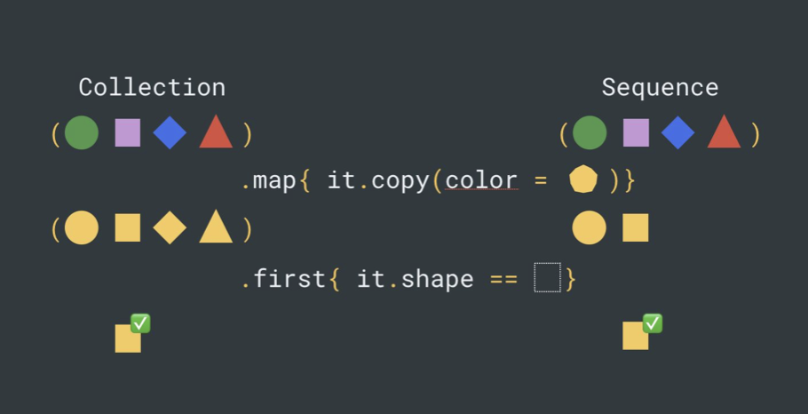
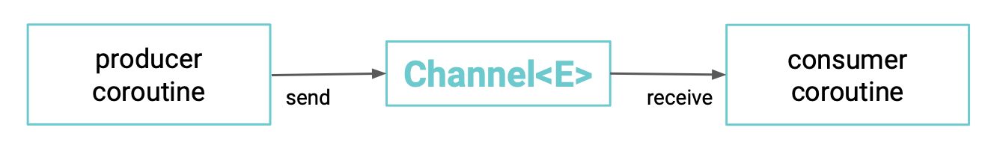

- [Sequence](#Sequence)
- [Flow](#Flow)
- [Channel](#Channel)

### Sequence

```kotlin
public interface Sequence<out T> { 
    /**
    * Returns an [Iterator] that returns the values from the sequence.
    *
    * Throws an exception if the sequence is constrained to be iterated once and `iterator` is
invoked the second time.
    */
    public operator fun iterator(): Iterator<T> 
}
```

Отличие Iterable<T> и Collection<T>:
```kotlin
val figure = listOf<Figure>(...)
    .map { it.copy(color = Color.YELLOW) } 
    .first { it.shape == Shape.SQUARE }
```

```kotlin

val figure = sequenceOf<Figure>(...)
    .map { it.copy(color = Color.YELLOW) } 
    .first { it.shape == Shape.SQUARE }
```



Создание:

```kotlin
// Пустая последовательность
emptySequence()
```
```kotlin
// Из набора элементов
sequenceOf(1, 2, 3)
```
```kotlin
// Ленивый билдер с suspend-лямбдой
sequence { yield(1)
    Thread.sleep(1000) yield(2)
    yield(3)
}
```
```kotlin
// Из коллекции
listOf(1, 2, 3).asSequence()
```
```kotlin
// Используя лямбду-фабрику итераторов
Sequence { iterable.iterator() }
```
```kotlin
// Используя функции для генерации значений
generateSequence { Random.nextInt() }

generateSequence(1) { it + 1 }

generateSequence(
    { Random.nextInt() }, 
    { it + 1 }
)
```

### Flow
```kotlin

public interface Flow<out T> {
    @InternalCoroutinesApi
    public suspend fun collect(collector: FlowCollector<T>) 
}

public interface FlowCollector<in T> { 
    /**
    * Collects the value emitted by the upstream.
    * This method is not thread-safe and should not be invoked concurrently.
    */
    public suspend fun emit(value: T) }
```

- Flow<E> представляет асинхронную последовательность элементов, аналогично Sequence<T>
- Этапы работы: билдер, оператор􏰄, терминал􏰂н􏰄й оператор
- Flow is cold
- Все вычисления происходят в контексте корутины, запустившей поток. Для смены контекста используется flowOn оператор

#### Создание:

```kotlin
// Пустой поток
emptyFlow()
```
```kotlin
// Из набора элементов
flowOf(1, 2, 3)
```
```kotlin
// Ленивый билдер
flow { 
    emit(1)
    emit(2) 
    delay(1000) 
    emit(3)
}
```
```kotlin
// Из коллекции
listOf(1, 2, 3).asFlow()
```
```kotlin
// Из последовательности
sequenceOf(1, 2, 3).asFlow()
```
```kotlin
// Контекстно- и потоко-безопасный билдер
channelFlow {
    launch { send("foo") } 
    delay(100) 
    send("bar")
}
```
```kotlin
// Контекстно- и потоко-безопасный билдер
callbackFlow {
    val timer = Timer() 
    timer.scheduleAtFixedRate(6L, 1000L) {
        trySendBlocking("text") 
    }
    awaitClose { timer.cancel() } }
```

#### Операторы:
```kotlin
// side-эффект
flow.onEach { log.info("Got item: $it") }

// side-эффекты/трансформации
flow.onStart { emit(...) } 
flow.onCompletion { emit(...) } 
flow.onEmpty { emit(...) } 
flow.catch { emit(...) }

// трансформации
flow.map { it + 1 } 
flow.filter { it != "foo" } 
flow.take(10)
flow.drop(5)

// буферизация
flow.buffer(128, BufferOverflow.DROP_OLDEST) 
flow.conflate()

// throttling
flow.debounce(1000) flow.sample(2000)

// retry
flow.retry(5) { throwable -> true }
flow.retryWhen { throwable, tryNum -> true }

// смена контекста выполнения
flow.flowOn(Dispatchers.IO)
```

#### Смена контекста

```kotlin
withContext(Dispatchers.Main) {
    val singleValue = intFlow // будет выполнен в IO, если другое не указано в потоке раньше
        .map { ... } // будет выполнен в IO 
        .flowOn(Dispatchers.IO)
        .filter { ... } // будет выполнен в Default 
        .flowOn(Dispatchers.Default)
        .single() // будет выполнен в Main
}
```

- Оператор flowOn запускает upstream операторы в указанном контексте 
- Для связи upstream и downstream используется канал

#### Как написать свой оператор?
```kotlin
fun <T: Any> Flow<T>.zipWithNext(): Flow<Pair<T, T>> = flow { 
    var current: T? = null
    collect { next ->
        if (current != null) {
            emit(current!! to next)
        }
        current = next
    }
}

flowOf(1, 2, 3, 4) 
    .zipWithNext()
    .collect { println(it) }

// console output:
// (1, 2)
// (2, 3)
// (3, 4)
```

#### Терминальные операторы

```kotlin
flow.collect { println(it) }

flow.collect()

val item = flow.first()

val item = flow.first { true }

val item = flow.single()

flow.launchIn(coroutineScope) // аналогично coroutineScope.launch { flow.collect() } val items = flow.toList()
```

### Channel

- Channel<E> используется для передачи значений между корутинами
- Аналог очередей, но не блокирует поток
- Multiple Producers Multiple Consumers
- Много поставщиков, много потребителей
- Буферы позволяют сократить число прерываний в корутинах
- При переполнении SUSPEND, DROP_OLDEST, DROP_LATEST
- Типы каналов: rendezvous, buffered, unlimited



```kotlin
public fun <E> Channel(
    capacity: Int = RENDEZVOUS,
    onBufferOverflow: BufferOverflow = BufferOverflow.SUSPEND, 
    onUndeliveredElement: (( E) -> Unit)? = null
): Channel<E>

val channel = Channel<Int>() 
channel.send(100500) 
channel.receive() 
channel.close()
```

Ресурсы в канале:
```kotlin
val channel = Channel<Closeable>(Channel.CONFLATED) {
    it.close() // Все недоставленные ресурсы будут закрыты каналом
}
// Producer code
channel.send(openResource()) 
channel.send(openResource())

// Consumer code
val resourceReceived = channel.receive() 
try {
   // work with received resource
} finally { 
    resourceReceived .close()
}
```