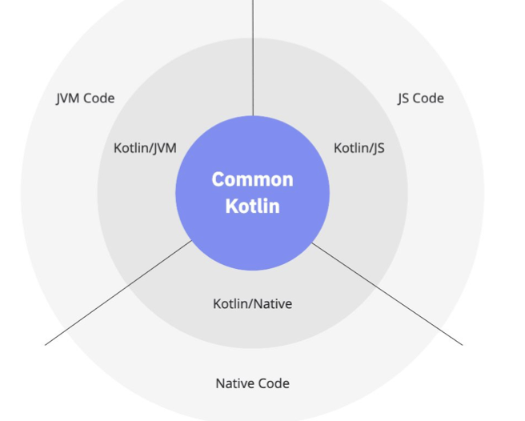
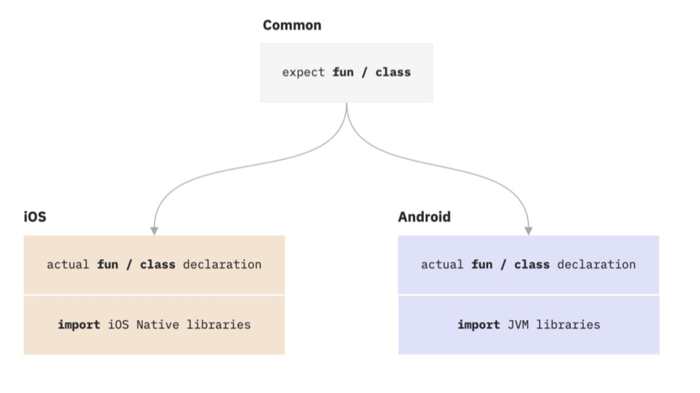

- [Документация по Kotlin Multiplatform](https://kotlinlang.org/docs/multiplatform.html)  
- [список библиотек с поддержкой Kotlin Multiplatform](https://github.com/AAkira/Kotlin-Multiplatform-Libraries)  
- [Елена Лепилкина - Kotlin/Native: между LLVM и VM (доклад)](https://www.youtube.com/watch?v=D4ViSA9KVEw)

- `expect` добавляется перед определяемой функцией
- `actual` определяет функцию/класс в платформенном модуле
- `external` говорит о том, что данная сущность реализована вне Kotlin

### Kotlin/JVM

- Основной сценарий использования, в рамках которого первоначал􏰀но создавался Kotlin (доступно всё наследие экосистемы jvm)
- Функциональная совместимость в обе сторон􏰂 (Java -> Kotlin, Kotlin -> Java)
- Поддержка языка популярными фреймворками (Spring, Junit)
- Возможность использовать в одном проекте оба языка

#### Java из Kotlin: особенности работы

- Использование getters, setters как свойств
- Все объекты, которые «приходят» из Java–`nullable`, при этом поддерживаются
`nullability`-аннотации
- Использование типов (например, примитивы Java (`int`) будут соответствовать
`kotlin.Int`)
- Отсутствие checked-exceptions
- ...

#### Kotlin из Java: особенности работы:

- Использование свойств как getters, setters
- Отдельно стоящие функции преобразуется в классы со `static`-методами
- Преобразование модификаторов доступа
- Возможность переопределять некоторые аспекты путём использования аннотаций в
Kotlin-коде (см перечисление ниже)

- `@JvmStatic` – к примеру, возможность контроля генерации static-методов, определенных в объектах
- `@JvmName` – даёт возможность управлять генерируемыми в Java именами
- `@JvmOverloads` – возможность генерации перегруженных методов с различными вариантами значений по умолчанию
- `@Throws` – указание исключений, которые может бросать метод
- ...

### Kotlin/JS

- Может создавать код дл􏰁 браузера, модули UMD/AMD, приложения для запуска в Node.JS
- Kotlin – строго типизированный язык, JS – нет, это важно в контексте функциональной совместимости
- DSL дает возможность создавать сложные страницы с описанием в терминах предметной области с использованием JS API (Browser, DOM и так далее)
- Для настройки используется gradle-плагин `kotlin.js` и ветка конфигурации kotlin `{ js { ... } }`

Установка зависимостей и библиотек
- Можно подключать библиотеки через `npm` (gradle): `implementation(npm("react", "> 14.0.0 <=16.9.0"))`
- Для взаимодействия с кодом платформ􏰂 используется специальные аннотированные классы и методы
- Для сборки приложения используется `Webpack`
- Можно создавать модули (@JsModule) и подключать вне􏰆ние определения (`@JsName` перед переменной или функцией `external fun`, `external val`)

Основные возможности
- API (DOM/Browser) 
- Вызов JS-кода в разных вариантах
- Поддерживает реализации основной Kotlin stdlib (включая корутины, но не поддерживается runBlocking, генерируются Promises)
